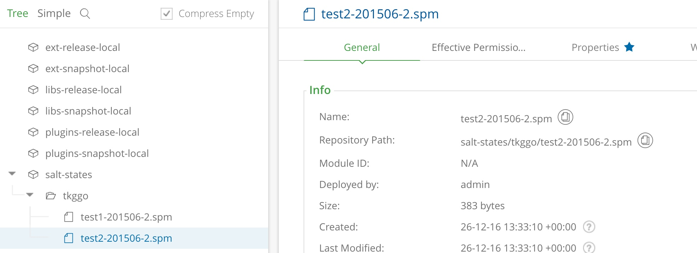

setup oss artifactory

https://www.jfrog.com/confluence/display/RTF/Running+Artifactory+OSS

oc cluster up --public-hostname=lamp.ovhome.local --routing-suffix='openshift.ovhome.local'

docker exec -it origin oadm policy add-scc-to-user anyuid   system:serviceaccount:myproject:default
oc new-app docker.bintray.io/jfrog/artifactory-oss:latest
oc expose service artifactory-oss
oc cluster down

  ```
curl -uadmin:xxxxxx -T /Users/guo/spm_push/test1-201506-2.spm  "http://localhost:8081/artifactory/salt-states/tkggo/test1-201506-2.spm"
{
  "repo" : "salt-states",
  "path" : "/tkggo/test1-201506-2.spm",
  "created" : "2016-12-26T13:21:48.595Z",
  "createdBy" : "admin",
  "downloadUri" : "http://localhost:8081/artifactory/salt-states/tkggo/test1-201506-2.spm",
  "mimeType" : "application/octet-stream",
  "size" : "383",
  "checksums" : {
    "sha1" : "f8a660d387f9036bc21b0bfb8d5254b5bc5bd5e5",
    "md5" : "5bac9b0b139ef3a95ec2102d756fefe1"
  },
  "originalChecksums" : {
  },
  "uri" : "http://localhost:8081/artifactory/salt-states/tkggo/test1-201506-2.spm"
  ```
  ``` 
 curl -uadmin:xxxxxxx -O "http://localhost:8081/artifactory/salt-states/tkggo/test1-201506-2.spm"
 
 #checksum
 
 curl -XGET http://10.0.0.204:8081/artifactory/api/storage/salt-states/tkggo/test2-201506-2.spm
{
  "repo" : "salt-states",
  "path" : "/tkggo/test2-201506-2.spm",
  "created" : "2016-12-26T13:33:10.519Z",
  "createdBy" : "admin",
  "lastModified" : "2016-12-26T13:33:10.513Z",
  "modifiedBy" : "admin",
  "lastUpdated" : "2016-12-26T13:33:10.513Z",
  "downloadUri" : "http://10.0.0.204:8081/artifactory/salt-states/tkggo/test2-201506-2.spm",
  "mimeType" : "application/octet-stream",
  "size" : "383",
  "checksums" : {
    "sha1" : "f8a660d387f9036bc21b0bfb8d5254b5bc5bd5e5",
    "md5" : "5bac9b0b139ef3a95ec2102d756fefe1"
  },
  "originalChecksums" : {
    "sha1" : "f8a660d387f9036bc21b0bfb8d5254b5bc5bd5e5",
    "md5" : "5bac9b0b139ef3a95ec2102d756fefe1"
  },
  "uri" : "http://10.0.0.204:8081/artifactory/api/storage/salt-states/tkggo/test2-201506-2.spm"
  
  
  
  
  curl -I http://10.0.0.204:8081/artifactory/salt-states/tkggo/test2-201506-2.spm
HTTP/1.1 200 OK
Server: Artifactory/4.15.0
X-Artifactory-Id: 520c9d2c15dc7f26:4184f2ce:1593b46336c:-8000
Last-Modified: Mon, 26 Dec 2016 13:33:10 GMT
ETag: f8a660d387f9036bc21b0bfb8d5254b5bc5bd5e5
X-Checksum-Sha1: f8a660d387f9036bc21b0bfb8d5254b5bc5bd5e5
Accept-Ranges: bytes
X-Checksum-Md5: 5bac9b0b139ef3a95ec2102d756fefe1
X-Artifactory-Filename: test2-201506-2.spm
Content-Disposition: attachment; filename="test2-201506-2.spm"; filename*=UTF-8''test2-201506-2.spm
Content-Type: application/octet-stream
Content-Length: 383
Date: Mon, 26 Dec 2016 20:56:56 GMT


#######################
udo salt-call state.sls artiext
[WARNING ] /usr/lib/python2.7/site-packages/salt/grains/core.py:1493: DeprecationWarning: The "osmajorrelease" will be a type of an integer.

local:
----------
          ID: extract_myapp
    Function: archive.extracted
        Name: /tmp/salt
      Result: True
     Comment: http://10.0.0.204:8081/artifactory/salt-states/tkggo/test2-201506-2.spm extracted to /tmp/salt/
     Started: 22:25:20.728975
    Duration: 130.377 ms
     Changes:
              ----------
              directories_created:
                  - /tmp/salt/
              extracted_files:
                  no tar output so far

Summary for local
------------
Succeeded: 1 (changed=1)
Failed:    0
------------
Total states run:     1
Total run time: 130.377 ms
 guo    srv  salt  $  ls /tmp/salt/
test1
 guo    srv  salt  $  ls /tmp/salt/test1/
FORMULA  test.sls
 guo    srv  salt  $  cat artiext
cat: artiext: No such file or directory
 guo    srv  salt  $  cat artiext.sls
extract_myapp:
  archive.extracted:
    - name: /tmp/salt
    - source: http://10.0.0.204:8081/artifactory/salt-states/tkggo/test2-201506-2.spm
    - archive_format: tar
    - tar_options: j
    - source_hash: md5=5bac9b0b139ef3a95ec2102d756fefe1
 
  ```



```
sudo salt-call state.show_sls arti
[WARNING ] /usr/lib/python2.7/site-packages/salt/grains/core.py:1493: DeprecationWarning: The "osmajorrelease" will be a type of an integer.

local:
    ----------
    test2-201506-2.spm:
        ----------
        __env__:
            base
        __sls__:
            arti
        file:
            |_
              ----------
              name:
                  /tmp/test2-201506-2.spm
            |_
              ----------
              source:
                  http://10.0.0.204:8081/artifactory/salt-states/tkggo/test2-201506-2.spm
            - managed
            |_
              ----------
              order:
                  10000
$ sudo salt-call state.apply arti test=True


local:
----------
          ID: test2-201506-2.spm
    Function: file.managed
        Name: /tmp/test2-201506-2.spm
      Result: None
     Comment: The file /tmp/test2-201506-2.spm is set to be changed
     Started: 21:28:30.874243
    Duration: 30.388 ms
     Changes:

Summary for local
------------
Succeeded: 1 (unchanged=1)
Failed:    0
------------
Total states run:     1
Total run time:  30.388 ms
$ sudo salt-call state.apply arti test=True
$ cat arti.sls
cat arti.sls
test2-201506-2.spm:
  file.managed:
    - name: /tmp/test2-201506-2.spm
    - source: http://10.0.0.204:8081/artifactory/salt-states/tkggo/test2-201506-2.spm
    - source_hash: md5=5bac9b0b139ef3a95ec2102d756fefe1
    


sudo salt-call state.apply arti
[WARNING ] /usr/lib/python2.7/site-packages/salt/grains/core.py:1493: DeprecationWarning: The "osmajorrelease" will be a type of an integer.

local:
----------
          ID: test2-201506-2.spm
    Function: file.managed
        Name: /tmp/test2-201506-2.spm
      Result: True
     Comment: File /tmp/test2-201506-2.spm updated
     Started: 21:59:41.971597
    Duration: 11.735 ms
     Changes:
              ----------
              diff:
                  New file
              mode:
                  0644

Summary for local
------------
Succeeded: 1 (changed=1)
Failed:    0
------------
Total states run:     1
Total run time:  11.735 ms
 guo    srv  salt  $  ls /tmp/test2-201506-2.spm
/tmp/test2-201506-2.spm


```
